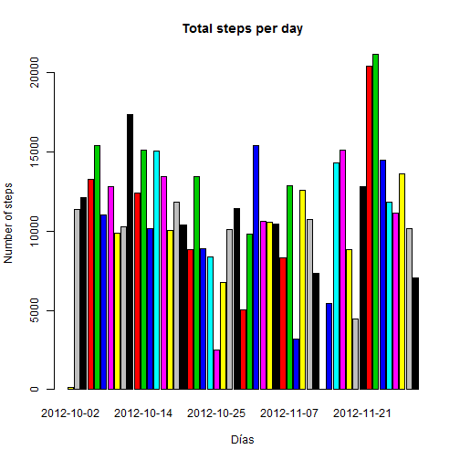
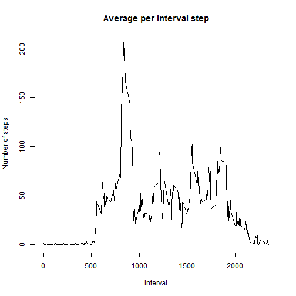
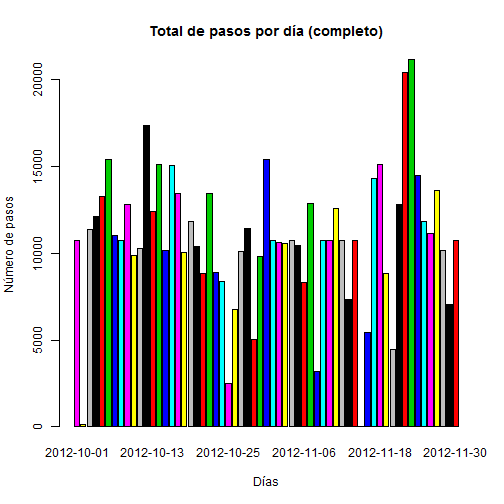

**Loading and preprocessing the data**

Show any code that is needed to

1. Load the data (i.e. read.csv())


```r
tabAll = read.csv("activity.csv", sep=",", header=TRUE, colClasses = "character")
```

```
## Warning in file(file, "rt"): cannot open file 'activity.csv': No such file
## or directory
```

```
## Error in file(file, "rt"): cannot open the connection
```

2. Process/transform the data (if necessary) into a format suitable for your analysis

```r
## Strings are converted to their corresponding types.
tabAll[,1] = as.numeric(tabAll[,1])
tabAll[,2] = as.Date(tabAll[,2],"%d/%m/%Y")
tabAll[,3] = as.numeric(tabAll[,3])

head(tabAll)
```

```
##   steps       date interval
## 1    NA 2012-10-01        0
## 2    NA 2012-10-01        5
## 3    NA 2012-10-01       10
## 4    NA 2012-10-01       15
## 5    NA 2012-10-01       20
## 6    NA 2012-10-01       25
```


**What is mean total number of steps taken per day?**

For this part of the assignment, you can ignore the missing values in the dataset.

1. Calculate the total number of steps taken per day


```r
## Remove all of the steps nulls
tabAct=subset(tabAll, !is.na(steps))
## Applies all the functions (sum, mean, median, max) that are required
stat_vs_date = summaryBy(steps ~ date, data=tabAct, FUN=c(sum, mean, median))
## It presents the first values of the sum of steps per day
head(stat_vs_date[,c(1, 2)])
```

```
##         date steps.sum
## 1 2012-10-02       126
## 2 2012-10-03     11352
## 3 2012-10-04     12116
## 4 2012-10-05     13294
## 5 2012-10-06     15420
## 6 2012-10-07     11015
```

2. If you do not understand the difference between a histogram and a barplot, research the difference between them. Make a histogram of the total number of steps taken each day


```r
barplot(stat_vs_date$steps.sum, col=stat_vs_date$date, names = stat_vs_date$date, main="Total steps per day", xlab = "DÌas", ylab = "Number of steps")
```

 

3. Calculate and report the mean and median of the total number of steps taken per day


```r
head(stat_vs_date[,c(1, 3, 4)])
```

```
##         date steps.mean steps.median
## 1 2012-10-02    0.43750            0
## 2 2012-10-03   39.41667            0
## 3 2012-10-04   42.06944            0
## 4 2012-10-05   46.15972            0
## 5 2012-10-06   53.54167            0
## 6 2012-10-07   38.24653            0
```

**What is the average daily activity pattern?**

1. Make a time series plot (i.e. type = "l") of the 5-minute interval (x-axis) and the average number of steps taken, averaged across all days (y-axis)


```r
## Calculate the average for each interval
stat_vs_interval = summaryBy(steps ~ interval, data=tabAct, FUN=c(mean))

plot(x=stat_vs_interval$interval, y=stat_vs_interval$steps.mean, type="l", main="Average per interval step", xlab = "Interval", ylab = "Number of steps")
```

 


2. Which 5-minute interval, on average across all the days in the dataset, contains the maximum number of steps?


```r
max(stat_vs_interval$steps.mean)
```

```
## [1] 206.1698
```


**Imputing missing values**

Note that there are a number of days/intervals where there are missing values (coded as NA). The presence of missing days may introduce bias into some calculations or summaries of the data.

1. Calculate and report the total number of missing values in the dataset (i.e. the total number of rows with NAs)


```r
## Gets the number of rows
dim(subset(tabAll, is.na(steps)))[1]
```

```
## [1] 2304
```

2. Devise a strategy for filling in all of the missing values in the dataset. The strategy does not need to be sophisticated. For example, you could use the mean/median for that day, or the mean for that 5-minute interval, etc.


```r
## Create a data.form with nulls steps
tabNA = tabAll[is.na(tabAll[,1]),]

## Make join of data.form witout nulls ago with the data.form having the average interval steps
mergeData = arrange(join(tabNA, stat_vs_interval), interval)
```

```
## Joining by: interval
```

```r
names(mergeData) = c("nulo", "date", "interval", "steps")
head(mergeData)
```

```
##   nulo       date interval    steps
## 1   NA 2012-10-01        0 1.716981
## 2   NA 2012-10-08        0 1.716981
## 3   NA 2012-11-01        0 1.716981
## 4   NA 2012-11-04        0 1.716981
## 5   NA 2012-11-09        0 1.716981
## 6   NA 2012-11-10        0 1.716981
```

3. Create a new dataset that is equal to the original dataset but with the missing data filled in.


```r
## Create a data.form where null values as replaced with the mean values of the intervals. 
tabComplete = rbind(tabAct, mergeData[,c(4, 2, 3)])
## Sort the records
tabComplete = tabComplete[order(tabComplete$date),]
head(tabComplete)
```

```
##            steps       date interval
## 152651 1.7169811 2012-10-01        0
## 152731 0.3396226 2012-10-01        5
## 152811 0.1320755 2012-10-01       10
## 152891 0.1509434 2012-10-01       15
## 152971 0.0754717 2012-10-01       20
## 153051 2.0943396 2012-10-01       25
```

4. Make a histogram of the total number of steps taken each day and Calculate and report the mean and median total number of steps taken per day. Do these values differ from the estimates from the first part of the assignment? What is the impact of imputing missing data on the estimates of the total daily number of steps?


```r
## Gets the sum, mean and median per day
tot_steps_date2 = summaryBy(steps ~ date, data=tabComplete, FUN=c(sum, mean, median))

barplot(tot_steps_date2$steps.sum, col=tot_steps_date2$date, names = tot_steps_date2$date, main="Total de pasos por dÌa (completo)", xlab = "DÌas", ylab = "N˙mero de pasos")
```

 

```r
## It presents the first values of the sum of steps per day
head(tot_steps_date2[,c(1, 3, 4)])
```

```
##         date steps.mean steps.median
## 1 2012-10-01   37.38260     34.11321
## 2 2012-10-02    0.43750      0.00000
## 3 2012-10-03   39.41667      0.00000
## 4 2012-10-04   42.06944      0.00000
## 5 2012-10-05   46.15972      0.00000
## 6 2012-10-06   53.54167      0.00000
```

```r
head(stat_vs_date[,c(1, 3, 4)])
```

```
##         date steps.mean steps.median
## 1 2012-10-02    0.43750            0
## 2 2012-10-03   39.41667            0
## 3 2012-10-04   42.06944            0
## 4 2012-10-05   46.15972            0
## 5 2012-10-06   53.54167            0
## 6 2012-10-07   38.24653            0
```

```r
##It can be seen only on the 2010-10-01 day that is where I had all null values is affected by the substitution of null values. All other values are to continue looking, because the null values are replaced with the average values of the intervals, which does not alter significantly the behavior of the data.
```


**Are there differences in activity patterns between weekdays and weekends?**

For this part the weekdays() function may be of some help here. Use the dataset with the filled-in missing values for this part.

1. Create a new factor variable in the dataset with two levels - "weekday" Äand "weekday"Äù indicating whether a given date is a weekday or weekend day.


```r
# Create a column indicating the day of the week
tabComplete$day = weekdays(as.Date(tabComplete$date))
# Gets the number of the week in question
tabComplete$Numday = as.POSIXlt(tabComplete$date)$wday
# Create a column factor (weekday, weekend)
tabComplete$factor = "weekday"
tabComplete[tabComplete$Numday == 0 | tabComplete$Numday == 6, 6] = "weekend"
# It show the values of the interval 5
head(tabComplete[tabComplete$interval == 5,], 20)
```

```
##             steps       date interval       day Numday  factor
## 152731  0.3396226 2012-10-01        5     lunes      1 weekday
## 290     0.0000000 2012-10-02        5    martes      2 weekday
## 578     0.0000000 2012-10-03        5 miÈrcoles      3 weekday
## 866     0.0000000 2012-10-04        5    jueves      4 weekday
## 1154    0.0000000 2012-10-05        5   viernes      5 weekday
## 1442    0.0000000 2012-10-06        5    s·bado      6 weekend
## 1730    0.0000000 2012-10-07        5   domingo      0 weekend
## 152741  0.3396226 2012-10-08        5     lunes      1 weekday
## 2306    0.0000000 2012-10-09        5    martes      2 weekday
## 2594   18.0000000 2012-10-10        5 miÈrcoles      3 weekday
## 2882    0.0000000 2012-10-11        5    jueves      4 weekday
## 3170    0.0000000 2012-10-12        5   viernes      5 weekday
## 3458    0.0000000 2012-10-13        5    s·bado      6 weekend
## 3746    0.0000000 2012-10-14        5   domingo      0 weekend
## 4034    0.0000000 2012-10-15        5     lunes      1 weekday
## 4322    0.0000000 2012-10-16        5    martes      2 weekday
## 4610    0.0000000 2012-10-17        5 miÈrcoles      3 weekday
## 4898    0.0000000 2012-10-18        5    jueves      4 weekday
## 5186    0.0000000 2012-10-19        5   viernes      5 weekday
## 5474    0.0000000 2012-10-20        5    s·bado      6 weekend
```


2. Make a panel plot containing a time series plot (i.e. type = "l") of the 5-minute interval (x-axis) and the average number of steps taken, averaged across all weekday days or weekend days (y-axis). See the README file in the GitHub repository to see an example of what this plot should look like using simulated data


```r
## Gets the mean of the intvervals to weekday and weekend
stat_vs_interval_2 = summaryBy(steps ~ interval + factor, data=tabComplete, FUN=c(mean))
head(stat_vs_interval_2)
```

```
##   interval  factor steps.mean
## 1        0 weekday 2.25115304
## 2        0 weekend 0.21462264
## 3        5 weekday 0.44528302
## 4        5 weekend 0.04245283
## 5       10 weekday 0.17316562
## 6       10 weekend 0.01650943
```

```r
xyplot(steps.mean ~ interval | factor, data = stat_vs_interval_2, layout = c(1, 2), type="a", xlab="Interval", ylab="Number of steps")
```

 
